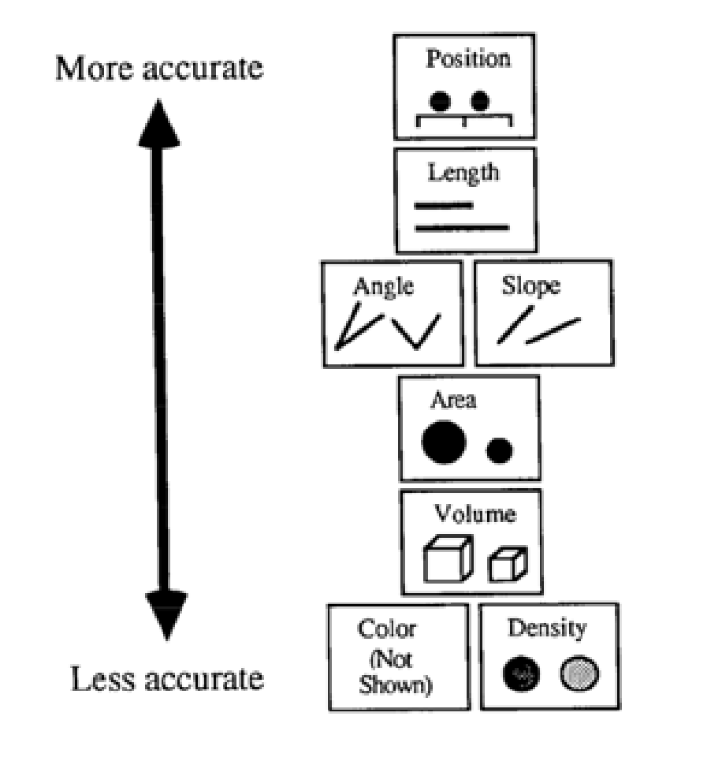

# Learning Tableau

Las principales son Tableau, PowerBI y Qlik

Sabestien Perez, Senior Data Science en Amadeus. Trabaja mucho con spark e inpala. También usa bastante python. Usa tableau para visualización. Crean un dashboard de referencia y ya la personalizan para cada aerolínea. 

Nos hemos instalado tableau desde su web.

La visualización suele ya tener menos datos a mostrar (ya se ha trabajado sobre los datos crudos, se ha filtrado, etc.)

Una persona sólo puede ver entre 7 y 10 elementos a la vez. Esto es porque en nuestro cerebro ya hay un preprocesador que filtra todo lo que nos llega a los ojos. 

`Tableau public` sólo te permite guardar a tableau propios. No te puedes conectar a una base de datos, pero si a datos en csv, json, etc. Tiene todo igual lo demás, así que para aprender valdría. 

Además, si está en tableau public, puedes ponerlo en tu web, tipo `El Pais`. 

Para guardarlo, tendré que hacer antes lo de exportar datos: en data / export data. 

## Páginas interesantes

- Infornation is beautiful.
- The pudding.
- Visualizing data. Tiene secciones con las mejores visualizaciones de cada mes y una sección con tutoriales. 
-  Data journalism: FiftyThittyEight, The Guardian, The Washinton Post. En lugar de poner un gráfico al lado de la noticia, lo que haces es poner el gráfico y alrededor de él comentas. 

## Datos de entrada

Los datos nos pueden llegar de varias formas 

- Estructura tabular.
- Estructura de árbol. Esto no lo vamos a hacer. 

## Tipos de variable

- Datos cuantitativos (Measure). Por ejenmplo, calorías
- Datos categóricos. Nominales (por ejemplo, tipo de comida) u ordenados (no es un número pero se puede ordenar: fecha, hora).

## Visual encoding

Codificar una variable a algo geométrico. Por ejemplo, de un valor a ángulo, a longitud, a posición, a ancho, a alto... 

Se hizo un estudio con 30 personas mostrándoles codificaciones para ver cómo de buena era esa codificación. El resultado es 
que el color es lo peor, porque hay mucho daltónico. 

(de [este paper](https://research.tableau.com/sites/default/files/p110-mackinlay.pdf))

Lo mejor es intentar que el gráfico quede bien en vlanco y negro y luego ya, si queremos reforzar, poner color. 

## Preattentive Processing

Si tú refuerzas un dato con algo que ayude, se verá mejor. Doble refuerzo o algo así. También lo contrario, intenta no poner elementos que molesten.

## Data vs Ink Ratio

En una gráfico podemos tener demasiada tinta para la cantidad de datos. Siempre keep-it simple. 

## Use Hue Color

Colores pasteles son los recomendados. 

## Examples of encoding.  Para cada ejemplo de la dioapo, soluciones

### 1. 

Fecha Inicio, Fecha fin, Name y Highlight.
 Elemento: barra. 
 
 - x: inicio
 - y: el índice. 
 - w = fecha fin y fecha inicio
 - altura: constante.
 
 ### 2. 
 
 Columnas: number of attemps, points per attemp, position
 
 Elemento: geometrico: cuadrado. 
 
 Codiciciones:
 - x: x.
 - y: y.
 - anchura: número de inrtentos. 
 - altura: número de intentos.
 - Color: puntos.
 
 ### 3.
 
 Columnas (solo para un equipo): ganar/perder/empate, fecha
 
 Elemento: Rectangular. 
 
 Codificaciones:
 - x: fecha partido.
 - y: resultado. 
 - anchura y altura constante.
 - color: resultado. 
 
 ### 4. 
 
 Columnas: latitud y longitud y densidad de población
 

## Basic charts

Ver diapo y [este enlace más complejo del Finantial Times](https://ft-interactive.github.io/visual-vocabulary/) 
o el [PDF que tiene todo](https://github.com/ft-interactive/chart-doctor/blob/master/visual-vocabulary/Visual-vocabulary.pdf)

# Usándolo

Empezmos con brain.csv.  PAra cada índice de animal, tenemos el peso del cuerpo y perso del cerebro. 

Si el csv no nos lo lee bien, tenemos que pulsar en el botón derecho en el nombre del archivo cuando ya los hemos cargado y pulsar en `Text
File Properties`

En el hashtag (que indica q1ue es de tipo número) de cada columna podemos hacer cosas, como seleccionar el tipo de columna. 

Ponemos la primera como de tipo string, porque en el fondo no es un número sino el índice y lo vamos a usar como label. 

En este caso, nuestra intención sería ver la relación entre el peso del cuerpo sin cabeza y el peso del cerebro 

Vamos a sheet 1. POdemos arrastras las mesaures a cada cosa. Si lo arrastramos,  a column, será x, a rows, será y, y si lo movemos por ejemplo a color, le pondrá un color. Además, automáticamente te hace una agregaciópn. 

Measure: medible.
Dimension: no medible: nombre de la columna, bin de un histograma. Si vemos el tamano de bin de histograma, podemos pulsar en botón derecho y modificar los parámetros. 

En Anaylsis: Aggregate Measures, puedo quitar la opción de que haga una agregación.

Otra opcíon es añadir otra dimensió, como por ejemplop en Index, en otro sitio, por ejemplo en Detail. 

Podemos pasar los dos ejes a escala logartímica para verlo bien. Botón derecho sobre el eje. 

## Dashboard

En lugar de uns hoja, podemos crear un dashboard que incluirá varios gráficos. Recomiendo poner tamaño automático. 

Al guardar puedo guardar como tablaue package workwook, que contendrá todos los datos dentro o como tableau notebook, que sólo guarda
las visualizaciones, por lo que buscará los datos en esa ruta (ruta absoluta). Vamos a guardarlo como package para que guarde todo. 

## Googletrends.csv

El csv tiene el número de búsuqedas para un mes de unos cuantos términos de búsqueda. 

Con esto podríamos evolución, una comparación

## apr_2011 (SnakeOil_2)

En este, cogen varios remedios (colágeno, ácido aspérgico, etc.). Miran qué cura cada uno, su popularidad y su evidencia, es decir, si ese
remedio está contrastado. Lo más importante: evidencoa, popularidad, categoría y nombre. 

Podemos hacer:
- Relación evidencia / popularidad. 
- Histogramas. 

## life countries

Representamos países. 

Los datos geográficos se pueden codificar en formatos espaciales como el geojson, topojson o shapefile.

Los ficheros geojson o topojson se pueden encontrar en internet (aquí teneis Madrid: https://github.com/codeforamerica/click_that_hood/blob/master/public/data/madrid.geojson)

No obstante para cosas más específicas, os podéis crear vuestro propio ficheros con esta herramienta online:
http://geojson.io/

Una vez que creáis vuestro fichero, lo podéis abrir en Tableau como fichero espacial.

Recomendación: siempre debemos añadirle latitud y longitud de los datos que generemos. 

## world temperatures

EL GHCN es una base de datos de datos meteorógicos de todo el mundo. En ese dataset se ha cogido la estación más cercna a la ciudad.

Longitude se suele abreviar como lgn. 

Aquí las columnas vienen como F1, F2, etc. Las hemos renombrado. Además, le hemos puesto rol geográfico a las columnas latitud, longitud,
país y ciudad. 

Intenciones posibles:
- Mapa. Para el mapa podemos hacerlo usando nuestra latitud y longitud o usando los servicios de geolocalización de tablaue
- Comparación.
- Evolución.
- Relación lat/lng con temperatura. 

Hemos tenido que poner la latitud y longitud como dimensión en lugar de  como measure

Hemos arrastrada la fecha a pages y eso permite hacer un play en la zona derecha para tener un gráfico que va avanzando en el tiempo

Vemos que tenemos datos erróneos (bajón de temperatura). Podemos pinchar en el dato y hacer `exclude`.

Además, hemos creado un dashboard en el que podemos mostrar las gr'aficas y filtrar por ambas.

Tambi'en hemos intentado usar la locaclización automática de tableau. Lo hace más o menos, pero siempre es mejor tener nuestra propia pat y lgn. 

Hemos arrastrado dos veces la longitud a row y nos apartecen dos marks. De uno ponemos city en lugar de pais y luego hacemos dual axis (mejor mira el vídeo...)

Se le pueden añadir sheets al tooltip!!!! 😱

## Chascariillos

- [Catálogo de visualizaciones](https://xeno.graphics/articles/on-graphonyms-the-importance-of-chart-type-names/)

- Jose Luis comenta que ellos usan una extensión para excel y power point que se llama [think-cell](https://www.think-cell.com/es/)

- Isaac Reyes, un _gurú_ de visualización sigue usando excel y power point. El cree que klo importante es el storytelling, en el que cree que los 
  gráficos deben ser sencillos. Con excel/power point puede personalizar la presentación aunque no puedas hacer cojográficos. Dejo un [link a un artículo suyo](https://medium.com/@ODSC/isaac-reyes-on-the-key-principles-of-data-storytelling-at-odsc-east-2018-6bfcdcf581b2.)
